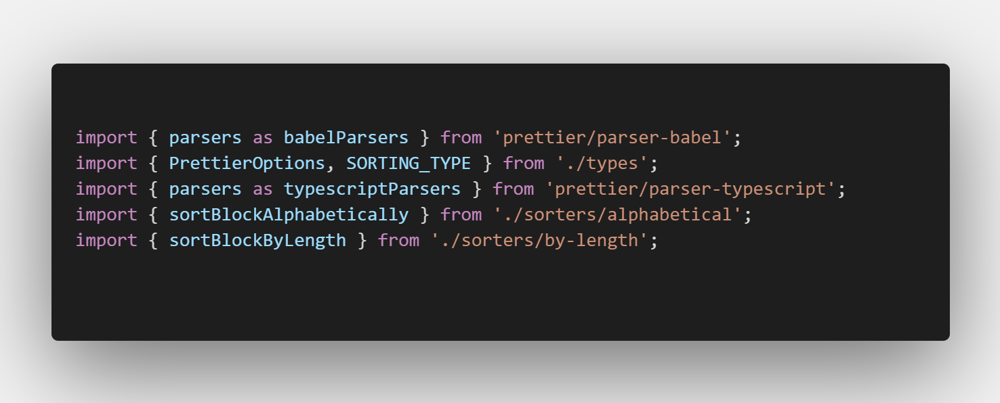
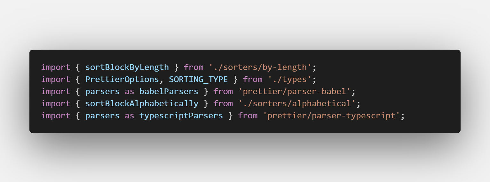

# Prettier Plugin: Ascending imports

A prettier plugin that sorts import statements by either their length in ascending order.

### Input


### Output


## Installation

```sh
npm install --save-dev prettier-plugin-ascending-imports
```

## Usage

The plugin will be loaded by Prettier automatically. No configuration needed. It will sort by import statement length by default.
